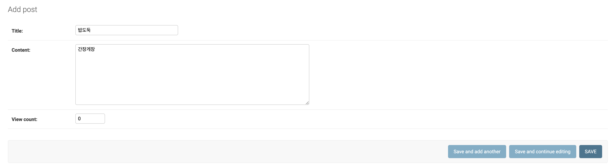

> goormedu의 [초보자를 위한 장고 뿌시기](https://edu.goorm.io/learn/lecture/16377/%EC%B4%88%EB%B3%B4%EC%9E%90%EB%A5%BC-%EC%9C%84%ED%95%9C-%EC%9E%A5%EA%B3%A0-django-%EB%BF%8C%EC%8B%9C%EA%B8%B0)를 보고 공부한 것을 정리합니다.

-	웹사이트 운영을 하다 보면 쌓이게 되는 많은 데이터
-	이러한 많은 데이터들을 관리하기 위해 관리자 페이지가 필요!
-	CRUD, 데이터 검색 및 필터링....
-	장고에서는 코드 몇 줄만 입력하면 쉽게 사용할 수 있는 관리자 페이지를 기본적으로 제공!

**기본주소(도메인)/admin** -> 관리자페이지 url로 접속 하게 되면 로그인 창이 뜬다! 접속하기 위해 super user를 만들어 주어야 한다.

```
python manage.py createsuperuser
```

를 터미널에 입력하고 ID, email, password를 설정하면 슈퍼유저가 생성된다.

이렇게 들어가게 되면 기본적으로 User, Group의 테이블이 존재한다. 이는 장고에서 기존에 만들어놓은 model들. 우리가 만들었던 post table을 관리자 페이지에서 관리 가능하게 하려면 post 폴더의 `admin.py`에서

```python
from django.contrib import admin
from  .models import Post

admin.site.register(Post)
```

-	현재 모듈(파일)에서는 Post 모델을 찾을 수 없기 때문에 import 필요
-	. : 같은 경로를 의미
-	-> `.models` : 같은 경로의 models에서


#### 관리자 페이지 커스터마이징

-	데코레이터를 통해 가능

```python
from django.contrib import admin
from  .models import Post

@admin.register(Post)
class PostAdmin(admin.ModelAdmin):
    list_display = (
        'id',
        'title',
        'content',
        'view_count',
        'created_at',
        'updated_at'
    )
    search_fields = (
        'title',
    )
```

-	`list_display` : tuple 형태로 관리자 페이지에서 보여주고 싶은 컬럼을 설정. 보통 콤마 단위로 줄바꿈해서 코딩

 - `search_fields` : tuple 형태로 검색 가능하도록 하는 컬럼을 설정. 반드시 마지막에 콤마를 써야 한다.

 - `list_filter` : Admin 사이트에 필터를 활성화할 항목을 설정하는 옵션

> **Date range filter 옵션** DateField를 list_filter 옵션에 추가하면 기본적으로 제공되는 필터링 옵션은 다음 4가지 항목 : Today, Past 7 days, This month, This year
>
> 그러나 현실에서는 날짜의 범위를 지정하여 필터링하는 경우가 더 많기 때문에, 기간 설정 필터링을 지원하는 패키지를 설치하여 사용하면 된다. django-admin-rangefilter와 같은 다양한 date range filter 패키지가 있다.
>
> 설치 방법은 command창의 pip를 이용하여 패키지를 설치한 후 INSTALLED_APPS에 추가하면 설치 완료.

```
$ pip install django-admin-rangefilter
```

```
#settings.py
INSTALLED_APPS = (
    ...
    'rangefilter',
    ...
)
```

```python
from django.contrib import admin
from rangefilter.filter import DateRangeFilter, DateTimeRangeFilter
from  .models import Post

@admin.register(Post)
class PostAdmin(admin.ModelAdmin):
    list_display = (
        'id',
        'title',
        'content',
        'view_count',
        'created_at',
        'updated_at'
    )
    list_filter = (
        ('created_at', DataRangeFilter),
    )
```

-	`list_display_links` : 목록 내에서 링크로 지정할 필드 목록 (이를 지정하지 않으면, 첫번째 필드에만 링크가 적용)
-	CRUD 가능




### References

-	[Django Admin 예쁘게 활용하기](https://teamlab.github.io/jekyllDecent/blog/tutorials/Django-Admin-%EC%BB%A4%EC%8A%A4%ED%84%B0%EB%A7%88%EC%9D%B4%EC%A7%95)
-	[Django 기본 07 - admin 커스터마이징, Model Admin](https://wayhome25.github.io/django/2017/03/22/django-ep8-django-admin/)
