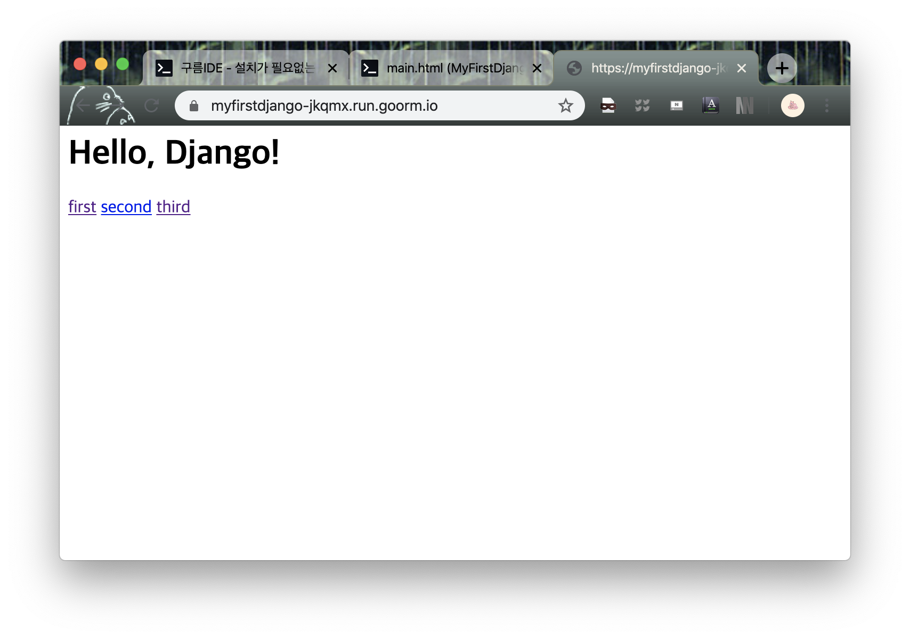
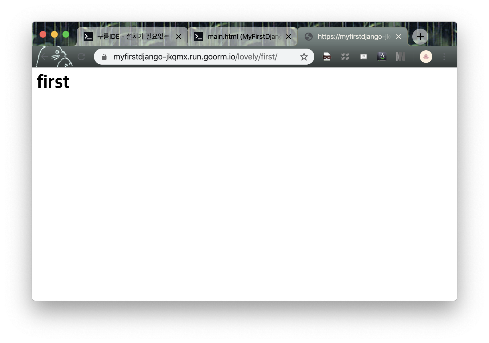

> goormedu의 [초보자를 위한 장고 뿌시기](https://edu.goorm.io/learn/lecture/16377/%EC%B4%88%EB%B3%B4%EC%9E%90%EB%A5%BC-%EC%9C%84%ED%95%9C-%EC%9E%A5%EA%B3%A0-django-%EB%BF%8C%EC%8B%9C%EA%B8%B0)를 보고 공부한 것을 정리합니다.


먼저 새로운 앱을 생성한다.
프로젝트의 기본 `urls.py`에 path를 추가해줄 수도 있지만, 앱의 개수가 많아질 경우 코드가 복잡해질 수 있다. 그렇기 때문에 앱 내에 `urls.py` 파일을 생성하고, 해당 코드에서 해당 앱의 경로를 관리한다.

```python
from django.urls import path
from .views import first, second, third

app_name="lovely"
urlpatterns = [
    path('first/', first, name="first"), # 순서대로 경로, views에 있는 함수, 경로를 불러주는 이름
    path('second/', second, name="second"),
    path('third/', third, name="third"),
]
```

위의 경로들은 `기본주소/lovely/first` 와 같은 형태로 접근 가능하다.
이 때 프로젝트의 기본 `urls.py`에 해당 앱의 경로를 **include** 해준다.

```python
from django.contrib import admin
from django.urls import path, include
from posts.views import main

urlpatterns = [
    path('admin/', admin.site.urls),
    path('', main, name="main"),
    path('lovely/', include('lovely.urls')), # lovely로 시작하는 경로는 이제 lovely의 urls.py에서 관리
]
```

이제 main 화면에서 lovely 앱의 first, second, third로 가는 경로를 생성한다.
`lovely/first` 와 같은 형식으로 경로를 지정해줄 수 있지만, 이 경우 유지보수성이 떨어지게 된다.
코드를 보다 간결하고 가독성 있게 하기 위해 lovely 앱의 `urls.py`에서 지정해준 `app_name` 과 템플릿 언어를 사용하여 다음과 같이 적을 수 있다.

```HTML
<h1>
    Hello, Django!
</h1>

<a href=''>first</a>
<a href=''>second</a>
<a href=''>third</a>
```




